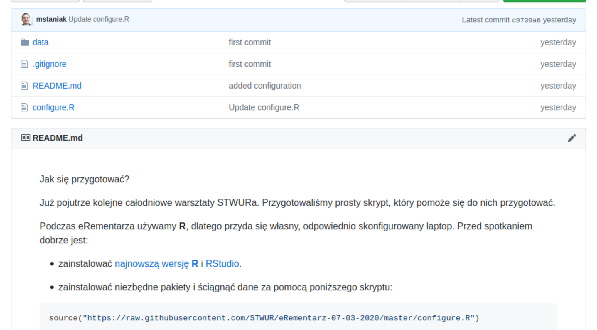
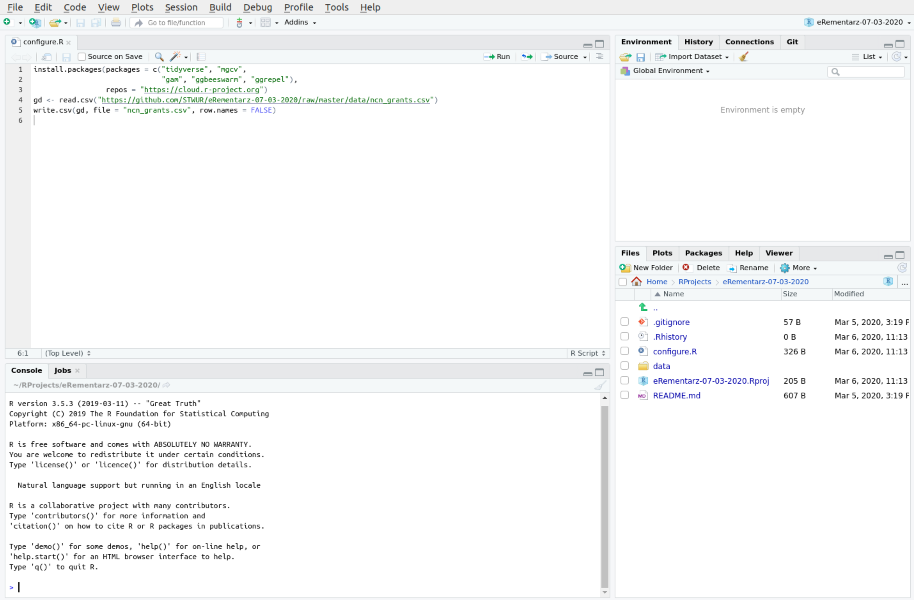
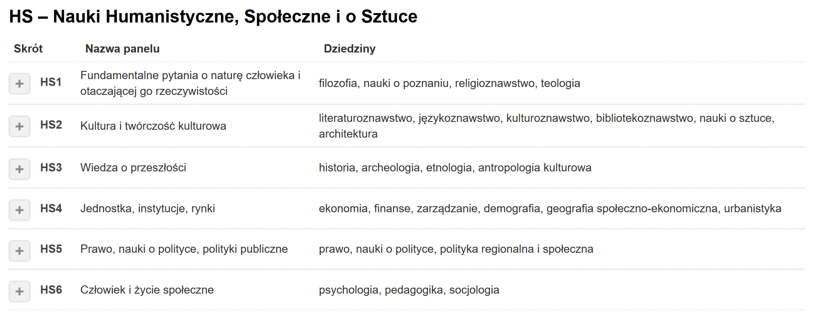
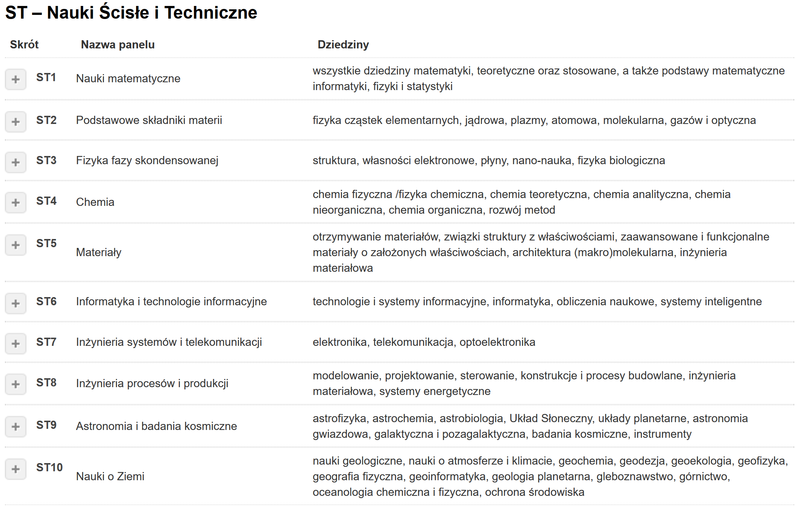
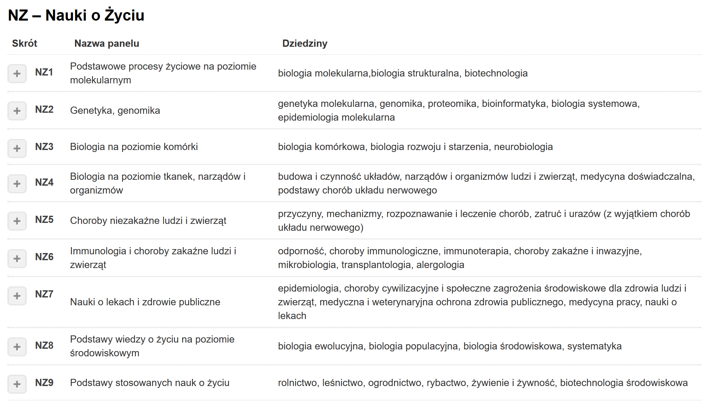

<link href="https://fonts.googleapis.com/css?family=Montserrat&display=swap" rel="stylesheet">
<style>
slides > slide {
  font-family: 'Montserrat', sans-serif;
}
.center {
  display: block;
  margin-left: auto;
  margin-right: auto;
}
</style>


## Pobieranie danych

https://github.com/STWUR/eRementarz-07-03-2020



## RStudio



## Instalacja i wczytywanie pakietów

Instalacja:
```{r eval = FALSE}
install.packages("tidyverse")
```

Wczytywanie:
```{r eval}
library(tidyverse)
```


## Wczytywanie i przypisywanie danych do zmiennej

```{r eval = TRUE}
dane <- read.csv("ncn_grants.csv")
```


## W razie problemów z wczytywaniem danych...

- sprawdź katalog roboczy funkcją
```{r}
getwd()
```

- jeżeli nie masz w tym katalogu pliku z danymi, przekopiuj je do niego lub poniższą funkcją zmień katalog roboczy podając ścieżkę do folderu, w którym znajdują się dane
```{r}
setwd("/home/kasia/RProjects/przetwarzanie_danych")
```


## Co zawierają nasze dane? 

Informacje o grantach przyznanych przez Narodowe Centrum Nauki

- id - numer identyfikacyjny wniosku
- type - rodzaj konkursu NCN
- date - data zakończenia naboru wniosków
- panel - główny dział nauk: HS, ST lub NZ
- subpanel - bardziej szczegółowy podział paneli
- budget - kwota przyznana na realizację projektu
- duration - czas trwania projektu
- coinvestigators - liczba badaczy zaangażowanych w realizację projektu


## Panele NCN



## Panele NCN



## Panele NCN

